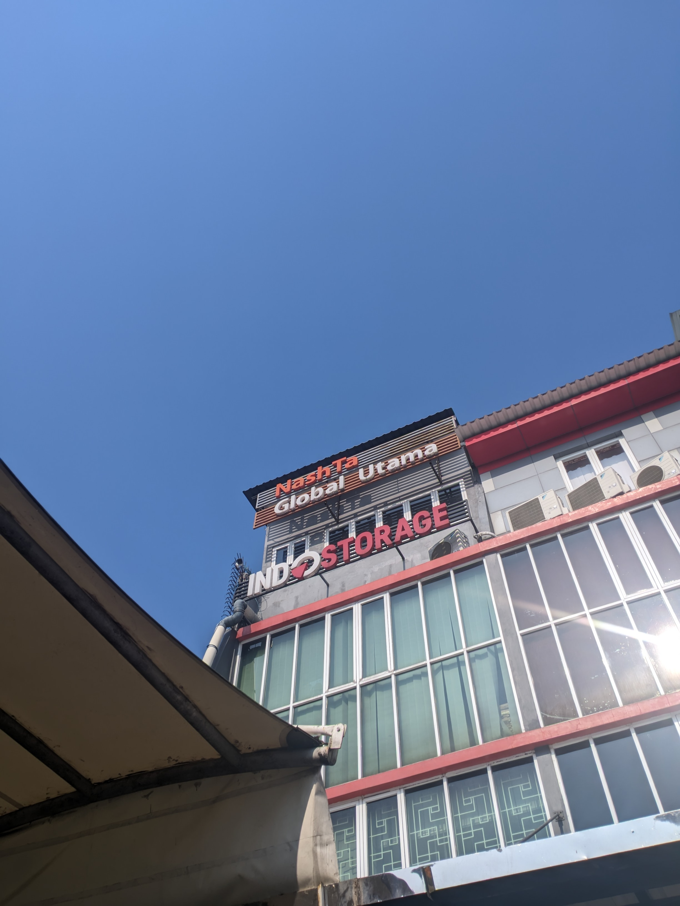
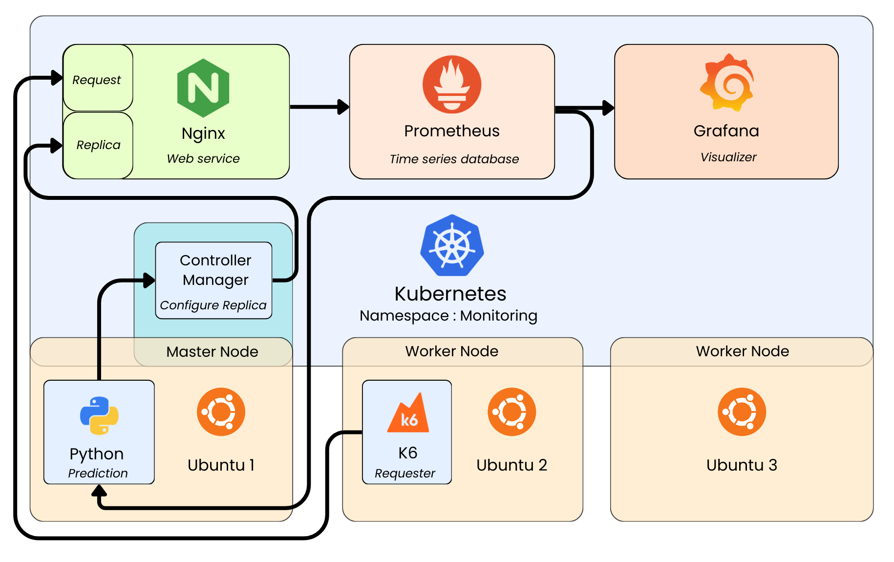
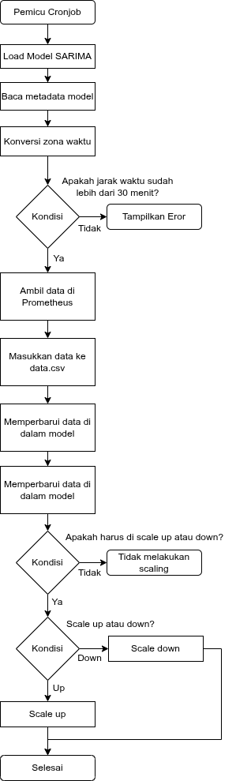

# Simulasi Containerized Workload Prediction

## Menggunakan Model SARIMA dengan Pendekatan AIOps

**Achmad Fadil Nur Ramdhani**

SMKN 1 Cimahi

PT Indostorage Solusi Teknologi

---
layout: two-cols
layoutClass: gap-12
---

<h1 style="view-transition-name: judul-indostorage">PT Indostorage Solusi Teknologi</h1>

<!-- Muncul saat klik pertama -->

Jl. Pramuka Raya, Mampang, Kec. Pancoran Mas, Kota Depok, Jawa Barat

::right::

<!-- Muncul saat klik kedua -->

  

    PT Indostorage Solusi Teknologi adalah perusahaan yang bergerak di bidang konsultasi teknologi informasi dan integrasi sistem. Perusahaan ini berkomitmen membantu organisasi dalam merancang, mengembangkan, serta menerapkan solusi teknologi yang tepat guna. Tujuannya adalah meningkatkan efisiensi operasional dan mendukung proses transformasi digital klien.
  

  

    PT Indostorage Solusi Teknologi memiliki kompetensi di berbagai bidang, seperti infrastruktur TI, kecerdasan buatan, analitik data, pengembangan aplikasi, komputasi awan, keamanan siber, dan integrasi sistem. 
  

---
layout: two-cols
layoutClass: gap-10

---

<h1>Latar Belakang</h1>

  

    Perkembangan teknologi yang cepat
  

  

    Sistem harus efisien & otomatis
  

  

    Kubernetes
  

::right::

  <!-- Kelompok 1: Chart dan Teks (Klik 1) -->
  

    <!-- Chart -->
    

      <Chart
        type="bar"
        :data="{
          labels: ['2020','2021','2022','2023','2024','2025'],
          datasets: [{
            label: 'Persen',
            data: [71, 77, 81, 84, 87, 90],
            backgroundColor: '#007bffff'
          }]
        }"
        :options="{
          responsive: true,
          maintainAspectRatio: false,
          plugins: { legend: { display: false }, tooltip: { enabled: true } },
          scales: { y: { beginAtZero: true, max: 100 }, x: { grid: { display: false } } },
          animation: { duration: 1000, easing: 'easeOutBounce' }
        }"
      />
    

    

      Berdasarkan data Komdigi (per April 2026), sebanyak 89 persen atau sekitar 167 juta penduduk Indonesia sudah menggunakan smartphone.
    

  

  

    <SlidevVideo
      v-click="2"
      autoplay
      controls
      class="max-h-full w-full max-w-3xl rounded-lg object-contain shadow-md"
    >
      <source src="./video/latarBelakang.mp4" type="video/mp4" />
    </SlidevVideo>
  

---

# Tujuan

  

    Merancang dan menyimulasikan sistem observabilitas pada lingkungan Kubernetes untuk mengumpulkan metrik aplikasi kontainer menggunakan Prometheus dan Grafana.
  

  

    Melakukan analisis deret waktu terhadap metrik beban kerja kontainer dan membangun model prediksi menggunakan model SARIMA.
  

  

    Mengembangkan alur kerja AIOps yang mengintegrasikan hasil prediksi model SARIMA ke dalam mekanisme penskalaan Kubernetes menggunakan skrip Python.
  

---

<h1>Batasan Masalah</h1>

  <ul>
    <li>Penulis membangun dan menguji seluruh kebutuhan sistem pada server Research & Development milik PT. Indostorage Solusi Teknologi.</li>
    <li>Infrastruktur server menggunakan sistem operasi Ubuntu 22.04.5 LTS dan diimplementasikan pada satu klaster Kubernetes berbasis RKE2 dengan spesifikasi 1 Node, ditambah 1 Node terpisah untuk simulasi permintaan.</li>
    <li>Aplikasi yang digunakan sebagai target prediksi adalah Nginx.</li>
    <li>Perangkat lunak K6 digunakan untuk membuat simulasi permintaan ke aplikasi Nginx, dan tidak mencakup stress test ekstrem atau failure testing.</li>
    <li>Akses ke layanan Grafana, Prometheus, dan Nginx diekspos menggunakan Ingress.</li>
    <li>Fokus simulasi model SARIMA terbatas pada prediksi satu metrik spesifik, yaitu metrik permintaan HTTP Nginx dari data observabilitas.</li>
    <li>Metode prediksi yang digunakan hanya model SARIMA, tanpa melakukan perbandingan dengan model pembelajaran mesin atau prediksi lain.</li>
    <li>Data metrik diambil melalui Prometheus dalam interval 15 detik.</li>
    <li>Penelitian tidak mencakup domain AIOps lain—seperti anomaly detection, log correlation, root cause analysis, atau incident remediation.</li>
  </ul>

---

<h1>Topologi Jaringan</h1>

---

<h1>Diagram Arsitektur</h1>

---

<h1>Diagram Workflow</h1>

---

<h1>Langkah Kerja</h1>

  <ul>
    <li>Akses dan Persiapan Lingkungan Virtual Machine</li>
    <li>Pembangunan Klaster Kubernetes</li>
    <li>Instalasi Lingkungan Pengujian dan Pengembangan</li>
    <li>Simulasi Layanan Web dan Sistem Pemantauan</li>
    <li>Konfigurasi Integrasi Antar Komponen Sistem</li>
    <li>Pelaksanaan Pengujian Beban Menggunakan K6</li>
    <li>Pengolahan dan Analisis Data Permintaan</li>
    <li>Pelatihan Model Prediksi Menggunakan SARIMA</li>
  </ul>

---

<h1>Akses dan Persiapan Lingkungan Virtual Machine dan Pembangunan Klaster Kubernetes</h1>

  

    

      Ubuntu
      
10.10.51.231

    

    

      Ubuntu
      
10.10.51.232

    

    

      Ubuntu
      
10.10.51.233

    

  

  

    

      <h2 class="mb-6 text-center !text-4xl !text-[#015fdb]">Kubernetes</h2>
      

        

          Ubuntu
          
10.10.51.231

        

        

          Ubuntu
          
10.10.51.232

        

        

          Ubuntu
          
10.10.51.233

        

      

    

  

---

<h1>Instalasi Lingkungan Pengujian dan Pengembangan</h1>

    

      Ubuntu
      
10.10.51.231

      
    

    

      Ubuntu
      
10.10.51.232

      
    

---

<h1>Simulasi Layanan Web dan Sistem Pemantauan</h1>

<h2 class="mb-6 text-center !text-4xl !text-[#015fdb]">Kubernetes</h2>

---

# Terima Kasih
## Tanya Jawab

Achmad Fadil Nur Ramdhani

